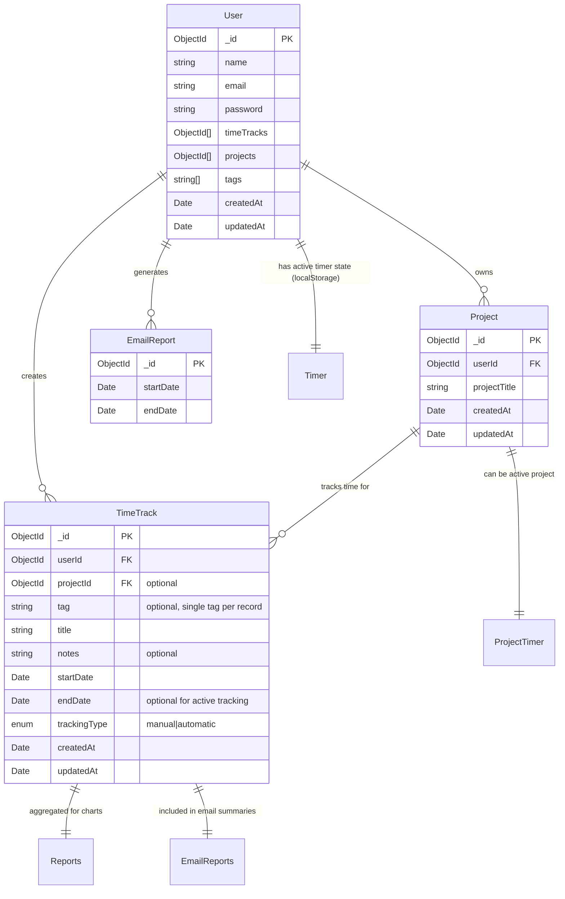

# MyTimer Domain Model

This diagram represents the complete domain model for the MyTimer application, showing all entities and their relationships.

## Key Relationships

### User Entity
- **Central entity** that owns all other data
- Has arrays of `timeTracks[]` and `projects[]` containing ObjectId references
- Maintains a `tags[]` array of strings for tag management
- Can have multiple projects and time tracking records

### Project Entity
- **Simple entity** belonging to a user via `userId` reference
- Contains basic project information (`projectTitle`)
- Can have multiple time tracking records associated with it
- Used in the timer system for project-based time tracking

### TimeTrack Entity
- **Core tracking entity** for time management
- References both User (`userId`) and optionally Project (`projectId`)
- Has a **single tag field** (`tag?: string`) - not an array
- Supports both manual and automatic tracking via `trackingType` enum
- Can have active tracking (no `endDate`) or completed tracking
- Contains notes and descriptive title for detailed tracking

### EmailReport Entity
- **Simple reporting entity** for email functionality
- Tracks date ranges for email report generation
- Used to prevent duplicate email reports for same period

## Application Features

### Timer System
- **Project-based timers** with persistent state (localStorage)
- **Global timer indicator** in header showing active project time
- **Check-in/Check-out functionality** for projects
- **Browser title integration** showing timer for active projects

### Reporting System
- **Weekly charts** (Bar Chart and Pie Chart) using Recharts
- **List view** for detailed time tracking records
- **Date navigation** for different time periods
- **Tag-based filtering** and project-based analysis

### Data Management
- **SWR integration** for efficient data fetching and caching
- **Real-time updates** when time tracking records are created/updated
- **Tag management** at user level with reusable tags across time tracks
- **Project organization** for better time tracking categorization

## Technology Stack
- **Frontend**: Next.js 14 with TypeScript (Pages Router)
- **Database**: MongoDB with Mongoose ODM
- **State Management**: React Context + SWR for data fetching
- **UI Components**: SCSS Modules + Radix UI primitives
- **Charts**: Recharts library for data visualization
- **Authentication**: NextAuth.js for session management